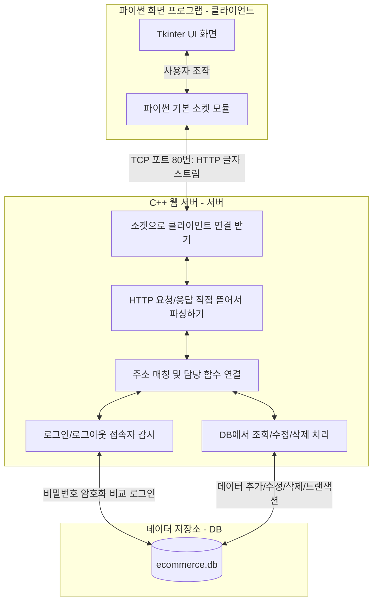
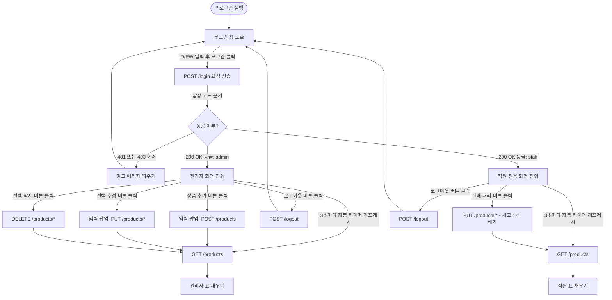

# 📦 C++ HTTP 소켓으로 직접 만든 재고 관리 시스템 

이 프로젝트는 C++의 기본 소켓 통신(POSIX 소켓 API)을 사용해서 HTTP/1.1 웹 서버를 처음부터 직접 만들었다. 그리고 SQLite3 데이터베이스와 SHA-256 암호화 알고리즘을 연결해서 회원 로그인 시스템이 들어간 RESTful 재고 관리 프로그램을 완성했다. 클라이언트 프로그램은 파이썬(Python)의 Tkinter 화면 라이브러리를 썼고, 라이브러리 대신 직접 소켓으로 HTTP 요청 메시지를 한 땀 한 땀 조립해서 서버와 주고받도록 개발했다.

이 설명서에는 전체적인 프로그램 구조, 파일 설명, 소스 코드가 어떻게 돌아가는지, 데이터베이스는 어떻게 만들었는지, 그리고 와이어샤크(Wireshark)로 분석한 5가지 HTTP 명령어 패킷 구조를 아주 자세하게 정리했다.

---

## 📑 목차
1. [전체적인 프로그램 구조](#1-전체적인-프로그램-구조)
2. [개발 환경 및 준비물](#2-개발-환경-및-준비물)
3. [폴더 및 파일 구조 분석](#3-폴더-및-파일-구조-분석)
4. [직접 만든 HTTP/1.1 웹 서버 동작 원리](#4-직접-만든-http11-웹-서버-동작-원리)
5. [데이터베이스 설계와 SQLite3 연결 방법](#5-데이터베이스-설계와-sqlite3-연결-방법)
6. [와이어샤크로 캡처한 HTTP 명령어 5개 분석](#6-와이어샤크로-캡처한-http-명령어-5개-분석)
7. [서버 응답 결과와 에러 코드 정리](#7-서버-응답-결과와-에러-코드-정리)
8. [파이썬 화면(GUI) 클라이언트가 돌아가는 흐름](#8-파이썬-화면gui-클라이언트가-돌아가는-흐름)
9. [컴파일하고 실행하는 방법](#9-컴파일하고-실행하는-방법)
10. [만들면서 느낀 한계점과 앞으로 고칠 점](#10-만들면서-느낀-한계점과-앞으로-고칠-점)

---

## 1. 전체적인 프로그램 구조

이 프로그램은 크게 **클라이언트, 서버, 데이터베이스** 3가지 부분으로 나누어서 설계했다. 복잡한 웹 프레임워크나 외부 HTTP 라이브러리를 쓰지 않고, 운영체제에서 기본으로 제공하는 네트워크 소켓 구멍(Socket)을 열어서 글자 형태로 오가는 HTTP 요청과 응답을 직접 뜯어보고 파싱해서 처리했다.



*   **클라이언트**: 파이썬 3으로 만든 컴퓨터 화면 프로그램이다. 화면을 그리기 위해 기본 라이브러리인 `Tkinter`를 썼다. 보통 편리하게 쓰는 `requests` 라이브러리를 쓰지 않고, `socket` 라이브러리로 직접 서버와 80번 포트로 연결을 맺은 뒤에 HTTP 문법에 맞춘 문자열을 직접 만들어서 전송하고 결과를 받아와서 화면에 보여준다.
*   **C++ 웹 서버**: C++로 작성한 메인 백엔드 서버다. 리눅스나 맥 OS에서 기본 제공하는 소켓 함수들(`socket.h`, `inet.h` 등)을 써서 80번 포트를 열고 클라이언트를 기다린다. 클라이언트가 접속해서 글자를 보내면 이를 읽어와서 첫 줄의 주소와 본문(Body)을 분석한 뒤, 알맞은 실행 함수로 연결해서 비즈니스 로직을 수행한다.
*   **데이터베이스**: 가볍고 파일 하나로 관리하기 편한 임베디드 관계형 데이터베이스인 SQLite3(`ecommerce.db`)를 썼다. 유저 목록(`users`)과 상품 목록(`products`) 테이블을 만들어 관리하고, C++ 코드 안에서 SQL 쿼리문을 직접 날려 데이터를 다룬다.

---

## 2. 개발 환경 및 준비물

### 서버 (C++ Server)
*   **운영체제**: 맥 OS(macOS) 또는 리눅스(Ubuntu 등)처럼 POSIX 규격을 지원하는 OS
*   **컴파일러**: C++11 규격 이상을 지원하는 GCC 또는 Clang 컴파일러
*   **라이브러리**: SQLite3 라이브러리 (`-lsqlite3` 옵션 필요)
*   **소켓**: 시스템 기본 소켓 함수들 (`sys/socket.h`, `unistd.h`, `arpa/inet.h` 등)

### 클라이언트 (Python Client)
*   **파이썬**: Python 3.8 버전 이상
*   **사용 라이브러리**: `socket`, `json`, `hashlib`, `tkinter` (파이썬 기본 내장 모듈 사용)

---

## 3. 폴더 및 파일 구조 분석

프로젝트 전체 파일들의 구조는 아래와 같이 나누어져 있다. C++ 컴파일할 때 나오는 오프젝트 파일(`.o`)들과 실행 파일(`server`), 그리고 데이터베이스 파이썬 파일들이 모여있다.

```text
.
├── README.md (이 설명서 파일이다)
├── server (컴파일해서 나온 최종 서버 실행 파일이다)
└── src
    ├── client
    │   └── client.py (파이썬으로 만든 화면 클라이언트 프로그램이다)
    ├── server
    │   ├── bin
    │   │   ├── ecommerce.db (데이터가 들어있는 SQLite3 DB 파일이다)
    │   │   └── server (서버 실행 파일이다)
    │   ├── include
    │   │   ├── DBSearch.hpp (DB 쿼리를 날릴 함수들을 적어놓은 헤더 파일이다)
    │   │   ├── httpRequest.hpp (HTTP 요청 글자를 쪼갤 파서 클래스 헤더 파일이다)
    │   │   ├── httpResponse.hpp (HTTP 응답 메시지를 만들 클래스 헤더 파일이다)
    │   │   ├── httpServer.hpp (소켓을 열고 연결을 분기해줄 헤더 파일이다)
    │   │   ├── login.hpp (로그인 및 중복 로그인 방지 세션 관리용 헤더 파일이다)
    │   │   └── sha256.hpp (비밀번호 암호화 함수용 헤더 파일이다)
    │   ├── makefile (자동으로 컴파일해 주는 빌드 설정 파일이다)
    │   ├── obj
    │   │   ├── DBSearch.o
    │   │   ├── httpRequest.o
    │   │   ├── httpResponse.o
    │   │   ├── httpServer.o
    │   │   ├── login.o
    │   │   └── main.o
    │   └── src
    │       ├── DBSearch.cpp (실제 SQLite3 DB를 CRUD 하는 코드 파일이다)
    │       ├── httpRequest.cpp (HTTP 헤더를 분석하고 JSON 값을 추출하는 코드 파일이다)
    │       ├── httpResponse.cpp (HTTP 응답 패킷 모양을 만드는 코드 파일이다)
    │       ├── httpServer.cpp (소켓을 열고 클라이언트 글자를 받아들이는 코드 파일이다)
    │       ├── login.cpp (비밀번호를 암호화해서 DB랑 확인하고 중복 로그인을 막는 코드 파일이다)
    │       └── main.cpp (어떤 주소로 왔을 때 어떤 함수를 실행할지 라우팅을 등록하는 메인 파일이다)
    └── test
        ├── create_DB.py (상품 테이블을 만들고 1000개짜리 랜덤 상품 샘플을 넣는 파이썬 파일이다)
        ├── create_loginDB.py (유저 테이블을 만들고 관리자/직원 계정을 세팅하는 파이썬 파일이다)
        ├── server_test.py (서버가 통신을 잘 하는지 테스트해 보는 파일이다)
        ├── shatest.py (파이썬과 C++의 암호화 결과가 똑같은지 비교해보는 파이썬 파일이다)
        ├── test_sha256 (SHA-256 검증용 테스트 실행 파일이다)
        └── test_sha256.cpp (SHA-256 해시 함수 테스트 코드 파일이다)
```

### 소스 파일 주요 역할 설명

#### 1. 서버 부분

*   **[main.cpp](file:///Users/wooseok/Desktop/computerNetwork/src/server/src/main.cpp)**
    *   서버를 구동하고 사용 가능한 주소(API 경로)들을 전부 등록하는 중심지 파일이다.
    *   서버 포트를 `80`번으로 연 뒤, `server.get`, `server.post` 같은 함수로 각각의 HTTP 요청 형태에 알맞게 매칭시켰다.
    *   로그인, 로그아웃, 전체 상품 보기, 단일 상품 상세 검색, 상품 추가, 수정, 삭제 등의 핸들러 함수를 여기에 작성해서 비즈니스 로직을 연결시켰다.

*   **[httpServer.hpp](file:///Users/wooseok/Desktop/computerNetwork/src/server/include/httpServer.hpp) / [httpServer.cpp](file:///Users/wooseok/Desktop/computerNetwork/src/server/src/httpServer.cpp)**
    *   실제 소켓 통신을 관리하는 뼈대 파일이다.
    *   소켓을 열고(`socket()`), 포트가 겹쳐서 안 켜지는 것을 방지하는 세팅(`SO_REUSEADDR`)을 적용한 다음, 80번 포트에 묶고(`bind()`), 연결을 받을 준비(`listen()`)를 끝낸다.
    *   `start()` 함수 안에서 무한 루프(`while(true)`)를 돌며 대기하다가, 클라이언트가 들어오면 연결을 승인(`accept()`)하고 최대 4096바이트만큼 읽어와서 해석을 요청한다. 응답을 전송한 직후에는 바로 연결 소켓을 닫아버리는 단순하고 확실한 방식으로 만들었다.
    *   `/products/*` 처럼 끝에 별표(`*`)가 들어간 주소도 잘 매칭되도록 돕는 코드(`matchRoute`)도 작성해 넣었다.

*   **[httpRequest.hpp](file:///Users/wooseok/Desktop/computerNetwork/src/server/include/httpRequest.hpp) / [httpRequest.cpp](file:///Users/wooseok/Desktop/computerNetwork/src/server/src/httpRequest.cpp)**
    *   클라이언트가 보낸 날것의 요청 글자들을 변수로 쪼개는 분석기 파일이다.
    *   HTTP 규칙상 헤더와 내용물(바디)은 줄바꿈 문자 2개(`\r\n\r\n`)로 나누어진다. 이 경계선을 찾아 앞부분(헤더)과 뒷부분(바디)을 따로 떼어냈다.
    *   그리고 첫 줄에서 공백 칸으로 구분되는 요청 메서드(`GET`, `POST` 등), 접근 주소(URI), 그리고 HTTP 버전을 변수로 추출해서 저장했다.
    *   추가로 복잡한 외부 파서 라이브러리 없이도 본문에 들어있는 JSON 안의 키값(ID나 PW 등)을 직접 찾아낼 수 있는 간단한 매칭 함수(`extractJsonValue`)를 직접 구현해 올렸다.

*   **[httpResponse.hpp](file:///Users/wooseok/Desktop/computerNetwork/src/server/include/httpResponse.hpp) / [httpResponse.cpp](file:///Users/wooseok/Desktop/computerNetwork/src/server/src/httpResponse.cpp)**
    *   클라이언트로 돌려줄 응답 편지를 규격에 맞게 포장하는 파일이다.
    *   성공 여부를 나타내는 상태 코드(`status_code`), 상태 이름(`status_message`), 돌려줄 데이터 양식(`content_type`), 그리고 내용물(`body`) 변수로 구성했다.
    *   `toString()` 함수를 실행하면 HTTP 표준 스펙에 맞게 `HTTP/1.1 200 OK` 등으로 시작하는 문자열을 한 줄씩 더해서 최종 소켓 전송용 버퍼를 조립해 준다.

*   **[login.hpp](file:///Users/wooseok/Desktop/computerNetwork/src/server/include/login.hpp) / [login.cpp](file:///Users/wooseok/Desktop/computerNetwork/src/server/src/login.cpp)**
    *   로그인 인증과 중복 로그인을 예방하는 역할을 한다.
    *   입력받은 평문 비밀번호를 `hash_sha256()` 함수를 통해 읽을 수 없는 해시글자로 바꾸고 DB에 저장된 값과 매칭했다.
    *   여러 컴퓨터에서 하나의 아이디로 중복 로그인을 시도하는 일을 차단하기 위해 로그인 성공 계정들을 `loggedInUsers`라는 보관함에 기록해 두고, 여러 사람이 동시에 접속 시도할 때 발생할 수 있는 메모리 꼬임 문제를 예방하기 위해 뮤텍스(`std::mutex`)와 락 가드를 걸어서 차례대로 안전하게 조회하도록 설계했다.

*   **[DBSearch.hpp](file:///Users/wooseok/Desktop/computerNetwork/src/server/include/DBSearch.hpp) / [DBSearch.cpp](file:///Users/wooseok/Desktop/computerNetwork/src/server/src/DBSearch.cpp)**
    *   SQLite3 C언어용 라이브러리를 사용해서 실제 데이터베이스 테이블을 건드리는 구문들을 모아놓은 파일이다.
    *   단일 상품 조회, 전체 조회, 상품 추가, 업데이트, 삭제 쿼리를 보낸다.
    *   특히 가격이나 수량 등을 변경할 때, 작업 중간에 서버가 비정상적으로 꺼지거나 도중에 멈춰서 데이터가 깨지거나 꼬이는 일(원자성 깨짐)을 막기 위해 SQLite3 트랜잭션 구문인 `BEGIN TRANSACTION`, `COMMIT`, `ROLLBACK`을 직접 코드에 심어두어서 안전하게 업데이트를 마치거나, 실패 시 이전 상태로 완전히 되돌리게 했다.

*   **[sha256.hpp](file:///Users/wooseok/Desktop/computerNetwork/src/server/include/sha256.hpp)**
    *   비밀번호가 털리지 않게 안전한 해시 암호화 함수를 정의해 둔 곳이다.

#### 2. 클라이언트 부분

*   **[client.py](file:///Users/wooseok/Desktop/computerNetwork/src/client/client.py)**
    *   파이썬 기본 GUI 라이브러리인 Tkinter 화면과 통신 코드를 합쳐 만든 실행 프로그램이다.
    *   여기에 작성한 `send_api_request()` 함수는 파이썬 기본 소켓으로 HTTP 문장을 손수 적어서 서버에 쏘고, 받아온 HTTP 응답 중 상태 번호와 JSON 결과만 잘라내 가공하는 수동 파싱 처리를 담당한다.
    *   사용자가 손으로 새로고침 버튼을 누르지 않아도 다른 컴퓨터에서 바꾼 최신 데이터가 바로 반영되도록, 백그라운드 타이머 기법으로 3초에 한 번씩 `GET /products` 요청을 자동으로 던져 표 데이터를 갱신한다.
    *   또한 로그인한 아이디의 등급(`admin`, `staff`)을 파악해서, 관리자 화면 또는 직원 전용 판매 화면을 다르게 보여주도록 권한을 제어했다.

---

## 4. 직접 만든 HTTP/1.1 웹 서버 동작 원리

이 웹 서버는 다른 무거운 프레임워크를 끌어다 쓰지 않고, HTTP 규칙대로 글자를 잘라서 분석하고 처리하는 방식으로 직접 코딩했다.

### HTTP 요청을 직접 해석하는 방식
C++ 서버의 [httpRequest.cpp](file:///Users/wooseok/Desktop/computerNetwork/src/server/src/httpRequest.cpp)에 작성한 해석 로직은 다음과 같이 작동한다.

1.  **헤더와 본문 쪼개기**:
    HTTP 약속상 헤더와 내용물(바디)은 무조건 연속 줄바꿈 기호인 `\r\n\r\n`으로 나누어 두어야 한다.
    ```cpp
    size_t body_pos = raw_request.find("\r\n\r\n");
    ```
    이 문자의 시작 위치를 찾아서 앞부분은 헤더 문자열로 빼고, 4칸 뒤인 나머지는 전부 본문(Body) 문자열로 담아서 나눴다.

2.  **첫 줄 요청 주소 읽기**:
    헤더의 맨 첫 줄은 요청의 정체(Request Line)이다. 이 부분을 받아와 빈칸(` `)을 기준으로 쪼갠다.
    ```cpp
    std::getline(stream, first_line);
    std::istringstream line_stream(first_line);
    line_stream >> method >> uri >> version;
    ```
    이 동작 덕분에 `GET`, `/products/3`, `HTTP/1.1` 같은 핵심 정보가 서버 변수에 착착 들어간다.

3.  **JSON 데이터 값 직접 추출하기**:
    JSON 구문 분석 라이브러리를 쓰지 않기 위해 직접 작성한 문자열 파인드 함수다.
    `"id": "admin"` 같은 패턴을 본문 글자 전체에서 찾아 따옴표 내부의 값을 오려내는 간단하고 빠른 메커니즘을 썼다.
    ```cpp
    std::string search_key = "\"" + key + "\":";
    size_t key_pos = body.find(search_key);
    // ... 빈칸이 더 있을 때 대처 코드 ...
    size_t start_quote = body.find("\"", key_pos + search_key.length());
    size_t end_quote = body.find("\"", start_quote + 1);
    return body.substr(start_quote + 1, end_quote - start_quote - 1);
    ```
    이 덕분에 다른 추가 모듈 설치 없이도 C++ 순수 코드로 속도 저하 없이 아주 가볍고 유연하게 돌아가도록 유도했다.

---

## 5. 데이터베이스 설계와 SQLite3 연결 방법

이 프로그램은 관계형 데이터베이스인 SQLite3를 사용하여 프로그램이 꺼져도 물품 데이터가 영구적으로 컴퓨터에 저장(`ecommerce.db` 파일)되게 연동했다.

### 데이터베이스 테이블(스키마) 설계

#### 1. 유저 정보 테이블 (`users`)
시스템에 로그인을 할 수 있는 회원 명단이다. 똑같은 아이디로 가입할 수 없게 `username`에는 고유값(`UNIQUE`) 제한을 걸어두었다.

```sql
CREATE TABLE users (
    id INTEGER PRIMARY KEY AUTOINCREMENT, -- 고유 번호
    username TEXT UNIQUE NOT NULL,        -- 로그인 아이디
    password_hash TEXT NOT NULL,          -- 비밀번호를 암호화해서 해시로 만든 글자
    role TEXT NOT NULL                    -- 등급 권한 ('admin' 또는 'staff')
);
```

#### 2. 상품 정보 테이블 (`products`)
실제 창고에 보관 중인 재고 상품 정보다.

```sql
CREATE TABLE products (
    id INTEGER PRIMARY KEY AUTOINCREMENT, -- 상품 일련번호 (1번부터 자동 생성)
    name TEXT NOT NULL,                   -- 상품 이름
    category TEXT NOT NULL,               -- 카테고리 분류
    price INTEGER NOT NULL,               -- 물건 가격 (원화 단위 숫자)
    stock INTEGER NOT NULL                -- 남아 있는 물량 개수
);
```

### 트랜잭션으로 안전한 변경 처리하기
가격이나 수량 데이터를 수정할 때 여러 사람이 동시에 건드려서 데이터가 꼬이거나, 서버 전원이 중간에 뚝 끊겨서 DB에 가격만 바뀌고 재고 수량은 안 바뀌는 문제가 생기면 곤란하다.
[DBSearch.cpp](file:///Users/wooseok/Desktop/computerNetwork/src/server/src/DBSearch.cpp)의 `updateProduct()` 함수는 이를 방지하고자 트랜잭션 구문을 SQL 파이프라인에 통째로 심어서 쿼리를 보냈다.

```cpp
// 1. 거래 시작 선언 (BEGIN)
sqlite3_exec(db, "BEGIN TRANSACTION;", nullptr, nullptr, nullptr);

// ... DB 업데이트 쿼리 실행 ...
// ... sqlite3_prepare_v2, sqlite3_bind_*, sqlite3_step 실행 ...

// 2. 오류가 전혀 없었다면 저장(COMMIT), 하나라도 실패했다면 무효화하고 돌아가기(ROLLBACK)
if (success) {
    sqlite3_exec(db, "COMMIT;", nullptr, nullptr, nullptr);
} else {
    sqlite3_exec(db, "ROLLBACK;", nullptr, nullptr, nullptr);
}
```
*   **완벽하게 다 같이 실행되거나 아니면 취소하거나**: 모든 업데이트 쿼리 동작이 완전히 끝났을 때만 실제 DB 파일에 한꺼번에 기록하도록 명령(`COMMIT`)을 날린다. 만약 중간에 에러가 나면 아예 안 고쳤던 예전 상태로 깨끗하게 원상복구(`ROLLBACK`)하여 정보 오염을 완전히 막았다.
*   **파일 잠금**: 수정 연산이 끝날 때까지 DB 파일 자체를 격리하므로 동시다발적으로 글 쓰기가 겹쳐 생기는 충돌도 사전에 방지했다.

---

## 6. 와이어샤크로 캡처한 HTTP 명령어 5개 분석

프로젝트가 켜져 있는 동안 내 컴퓨터 안(로컬 루프백 `127.0.0.1` 주소)에서 와이어샤크(Wireshark) 프로그램으로 실제 캡처한 네트워크 통신 내역을 분석해 보았다. 가장 많이 쓴 5가지 HTTP 명령어 패킷들의 세부 모양은 다음과 같았다.

---

### 1️⃣ 로그인 요청 [POST] `/login`

*   **설명**: 로그인 창에서 아이디와 암호를 넣었을 때 서버에 인증 승인을 요청한다.
*   **네트워크 흐름**:
    ```mermaid
    sequenceDiagram
        Client->>Server: POST /login HTTP/1.1 (본문에 ID/PW 입력해서 보냄)
        Note over Server: 암호 해시 변경 및 중복 로그인 목록 체크
        Server->>Client: HTTP/1.1 200 OK (role: "admin" 돌려줌)
    ```

#### 와이어샤크 캡처 데이터 (실제 패킷 내용)

**보낸 편지 (Client ➔ Server)**
```http
POST /login HTTP/1.1
Host: 127.0.0.1:80
Content-Type: application/json
Content-Length: 32
Connection: close

{"id": "admin", "pw": "1234"}
```
*   **메서드**: 비밀번호 같은 중요 정보가 인터넷 브라우저 주소창 등에 노출되는 것을 피하고자 주소 뒤에 값을 붙이지 않는 `POST` 방식을 사용했다.
*   **Content-Length**: 본문 내용인 `{"id": "admin", "pw": "1234"}` 글자 바이트 수인 `32`를 명시해서 수신 버퍼 낭비가 없게 처리했다.

**받은 답장 (Server ➔ Client)**
```http
HTTP/1.1 200 OK
Content-Type: application/json; charset=utf-8
Content-Length: 42
Connection: close

{"status": "success", "role": "admin"}
```
*   **상태 코드**: 로그인 정보 조회가 완전 성공했음을 나타내는 `200 OK`를 회신받았다.
*   **응답 본문**: 클라이언트가 다음 화면으로 바로 권한에 맞게 넘어가도록 등급 정보(`role: admin`)를 JSON 본문에 담아 받았다.

#### 서버 내부 동작 및 DB 동작 단계
1.  서버 소켓이 접속을 받으면 `HttpRequest::parse()`가 실행되어 요청 메서드가 `POST`이고 요청 경로가 `/login`인지 가려낸다.
2.  `main.cpp` 안의 `handleLogin()` 함수가 실행되면서 본문에서 키값 `"id"`와 `"pw"`의 실제 문자열을 파싱해서 들고 온다. (`id`는 `"admin"`, `pw`는 `"1234"`)
3.  `Login::authenticate()` 함수가 실행되어 날것의 암호 `"1234"`를 SHA-256 알고리즘에 대입해서 완전히 깨진 해시 데이터(`03ac674216f3e15c761ee1a5e255f067953623c8b388b4459e13f978d7c846f4`)로 만든다.
4.  중복 로그인 체크를 진행한다. 이미 접속 중인 리스트인 `loggedInUsers`에 `"admin"` 아이디가 이미 들어있는지 뒤진다. 들어있다면 중복 로그인으로 보고 즉시 `403 Forbidden` 상태 코드를 작성해서 탈출해 돌려보낸다.
5.  중복이 아니라면 SQLite DB 연결을 맺고 아래의 쿼리를 준비해서 질의한다.
    ```sql
    SELECT role FROM users WHERE username = 'admin' AND password_hash = '03ac674216f3e15c761ee1a5e255f067953623c8b388b4459e13f978d7c846f4';
    ```
6.  DB에서 일치하는 값을 확인해 그 행의 등급값(`admin`)을 가져온 다음, 접속 중인 리스트 `loggedInUsers`에 유저네임을 넣고 최종 로그인 성공 응답을 전송한다.

---

### 2️⃣ 전체 상품 목록 받아오기 [GET] `/products`

*   **설명**: 클라이언트 메인 화면의 상품 목록 표를 채우기 위해 전체 상품 데이터를 요구한다.
*   **네트워크 흐름**:
    ```mermaid
    sequenceDiagram
        Client->>Server: GET /products HTTP/1.1
        Note over Server: SQLite3 상품 테이블 전부 스캔
        Server->>Client: HTTP/1.1 200 OK (JSON 형식 상품 리스트)
    ```

#### 와이어샤크 캡처 데이터 (실제 패킷 내용)

**보낸 편지 (Client ➔ Server)**
```http
GET /products HTTP/1.1
Host: 127.0.0.1:80
Content-Type: application/json
Connection: close


```
*   **메서드**: 서버의 상품 데이터를 단순히 읽어오는 것일 뿐 데이터를 바꾸는 동작이 아니므로, 정석대로 `GET` 메서드를 썼다.
*   **본문**: 바디 본문에 실어 보낼 값이 없기 때문에 비워둔 상태로 요청을 끝냈다.

**받은 답장 (Server ➔ Client)**
```http
HTTP/1.1 200 OK
Content-Type: application/json; charset=utf-8
Content-Length: 178
Connection: close

[{"id":1,"name":"Premium Device 1","price":15000,"stock":42},{"id":2,"name":"Basic Tool 2","price":8500,"stock":15},{"id":3,"name":"Smart Gear 3","price":99000,"stock":0}]
```
*   **받아온 모양**: JSON 리스트 괄호 `[...]`로 감싸진 모든 상품의 아이디, 이름, 가격, 개수 데이터가 한 묶음으로 수신됐다.

#### 서버 내부 동작 및 DB 동작 단계
1.  서버 소켓 통신을 담당하는 부서에서 요청 주소 `/products` 매칭 주소를 읽어 `handleGetAllProducts()`로 처리를 인계한다.
2.  `DBSearch::getAllProducts()`가 돌면서 DB 파일을 연다. 그리고 아래 쿼리를 실어 보낸다.
    ```sql
    SELECT id, name, category, price, stock FROM products;
    ```
3.  `sqlite3_step()` 함수를 이용해서 반복문을 돌리면서 데이터베이스 조회 결과인 상품 테이블 행을 하나하나 읽어온다.
4.  C++ 안에서 문자열 더하기 연산을 수행해서 JSON 배열 형태의 글자(`[{"id":1, ...}, ...]`)를 한 땀 한 땀 조합해 낸다.
5.  최종으로 완성된 JSON 문자열 본문을 `httpResponse::body`에 박아놓고 소켓을 통해 발송했다.

---

### 3️⃣ 신상품 등록하기 [POST] `/products`

*   **설명**: 새로운 물건 정보를 인벤토리에 추가한다. (관리자 등급 계정만 실행 가능)
*   **네트워크 흐름**:
    ```mermaid
    sequenceDiagram
        Client->>Server: POST /products HTTP/1.1 (추가할 상품명, 가격, 수량 전달)
        Note over Server: SQL INSERT 실행해서 행 추가
        Server->>Client: HTTP/1.1 201 Created
    ```

#### 와이어샤크 캡처 데이터 (실제 패킷 내용)

**보낸 편지 (Client ➔ Server)**
```http
POST /products HTTP/1.1
Host: 127.0.0.1:80
Content-Type: application/json
Content-Length: 79
Connection: close

{"name": "Wireless Mouse X", "category": "Electronics", "price": "35000", "stock": "50"}
```
*   **메서드**: 서버 인벤토리에 없던 새 리소스를 탄생시키는(Create) 과정이므로 `POST` 메서드를 썼다.
*   **본문**: 집어넣을 상품명, 분류, 단가, 초기 수량의 설정 값이 JSON 양식으로 적혀있다.

**받은 답장 (Server ➔ Client)**
```http
HTTP/1.1 201 Created
Content-Type: application/json; charset=utf-8
Content-Length: 58
Connection: close

{"status":"success", "message":"상품이 추가되었습니다."}
```
*   **상태 코드**: 리소스가 새로 생성이 끝났을 때 정식으로 내려받는 상태 코드인 `201 Created`를 리턴받았다.

#### 서버 내부 동작 및 DB 동작 단계
1.  서버 라우터에 매핑된 `handleAddProduct()` 함수가 요청을 받는다.
2.  본문에서 상품의 이름, 분류, 가격, 수량 밸류를 `extractJsonValue()`로 끄집어낸다.
3.  이 중 하나라도 공백이거나 숫자 변환 중 에러가 날 만한 깨진 데이터라면 즉시 실행을 중단하고 `400 Bad Request` 에러 코드를 돌려보내게 조치했다.
4.  유효성 통과가 확인되면 `DBSearch::addProduct()` 함수 안에서 SQLite3를 호출해 다음 명령을 대입한다.
    ```sql
    INSERT INTO products (name, category, price, stock) VALUES ('Wireless Mouse X', 'Electronics', 35000, 50);
    ```
5.  정상 완료 신호(`SQLITE_DONE`)가 뜨면 DB와의 커넥션을 닫고 클라이언트에 결과 패킷을 전송한다.

---

### 4️⃣ 기존 상품 수정 및 재고 차감하기 [PUT] `/products/<id>`

*   **설명**: 상품 가격이나 재고 개수를 변경한다. (관리자가 물건 수정을 누르거나 직원이 판매 처리를 눌러서 재고를 하나 차감할 때 호출된다)
*   **네트워크 흐름**:
    ```mermaid
    sequenceDiagram
        Client->>Server: PUT /products/1 HTTP/1.1 (수정된 가격과 수량 전달)
        Note over Server: SQLite3 트랜잭션 켜서 안전하게 덮어쓰기
        Server->>Client: HTTP/1.1 200 OK
    ```

#### 와이어샤크 캡처 데이터 (실제 패킷 내용)

**보낸 편지 (Client ➔ Server)**
```http
PUT /products/1 HTTP/1.1
Host: 127.0.0.1:80
Content-Type: application/json
Content-Length: 57
Connection: close

{"name": "Premium Device 1", "price": "15000", "stock": "41"}
```
*   **메서드**: 이미 등록된 자원을 통째로 교체해서 업데이트(Update) 하는 목적이기 때문에 규격에 따른 `PUT` 메서드를 썼다.
*   **주소**: `/products/1`처럼 끝부분 주소 경로 뒤에 1번이라는 ID를 직접 명시했다.

**받은 답장 (Server ➔ Client)**
```http
HTTP/1.1 200 OK
Content-Type: application/json; charset=utf-8
Content-Length: 52
Connection: close

{"status":"success", "message":"업데이트 완료"}
```

#### 서버 내부 동작 및 DB 동작 단계
1.  서버 라우터에 입력된 주소에서 마지막 슬래시(`/`) 뒤 글자인 상품 ID `"1"`을 끄집어낸다.
2.  `handleUpdateProduct()` 함수에서 본문을 가공해서 수정한 이름 `"Premium Device 1"`, 가격 `15000`, 그리고 1개 감소하여 변경될 재고량인 `"41"` 데이터를 파싱해 온다.
3.  `DBSearch::updateProduct()` 안에서 아래와 같이 안전한 DB 트랜잭션 파이프라인을 작동시킨다.
    ```sql
    BEGIN TRANSACTION;
    UPDATE products SET name='Premium Device 1', price=15000, stock=41 WHERE id=1;
    ```
4.  만약 변경 성공 코드(`SQLITE_DONE`)가 리턴됐다면 변경을 실제 디스크에 고정(`COMMIT;`)시키고, 실패했다면 변경 내용을 취소(`ROLLBACK;`)하여 예전 상태로 원상복구시킨다.

---

### 5️⃣ 상품 정보 삭제하기 [DELETE] `/products/<id>`

*   **설명**: 상품 데이터를 테이블에서 영원히 지워버린다. (관리자 등급만 이용 가능)
*   **네트워크 흐름**:
    ```mermaid
    sequenceDiagram
        Client->>Server: DELETE /products/3 HTTP/1.1
        Note over Server: SQL DELETE & 삭제된 행 개수 체크
        Server->>Client: HTTP/1.1 200 OK
    ```

#### 와이어샤크 캡처 데이터 (실제 패킷 내용)

**보낸 편지 (Client ➔ Server)**
```http
DELETE /products/3 HTTP/1.1
Host: 127.0.0.1:80
Content-Type: application/json
Connection: close


```
*   **메서드**: 대상을 제거(Delete)하기 위해 명확하게 `DELETE` 메서드를 썼다.
*   **주소**: 지워버릴 3번 상품 ID가 주소 끝에 삽입되어 전송됐다.

**받은 답장 (Server ➔ Client)**
```http
HTTP/1.1 200 OK
Content-Type: application/json; charset=utf-8
Content-Length: 55
Connection: close

{"status":"success", "message":"상품이 삭제되었습니다."}
```

#### 서버 내부 동작 및 DB 동작 단계
1.  받아온 주소값에서 삭제 목표 ID인 `3`을 식별한다.
2.  `handleDeleteProduct()` 함수가 가동되고 `DBSearch::deleteProduct(3)` 함수를 작동시킨다.
3.  SQLite3 DB에 아래 명령어를 던진다.
    ```sql
    DELETE FROM products WHERE id = 3;
    ```
4.  여기서 예외 처리를 넣어주었다. 만약 없는 상품 번호(예: 이미 지워졌거나 가짜 번호)를 입력해서 지우려 했다면, SQL을 실행하고 바뀐 레코드 수를 세어주는 `sqlite3_changes()` 함수가 0을 반환하게 된다. 이때는 삭제에 실패했다고 보고 즉시 `404 Not Found` 에러 코드를 전송하도록 만들었다.
5.  정상 삭제됐다면 최종 완료 응답을 던져준다.

---

## 7. 서버 응답 결과와 에러 코드 정리

서버와 파이썬 화면 프로그램이 서로 원활하게 신호를 주고받을 수 있게 규격화해놓은 상태 코드 목록이다.

| 상태 코드 (Status) | 응답 문구 (Message) | 원인 (상황) | 클라이언트가 받아보는 본문 (JSON 예시) |
| :--- | :--- | :--- | :--- |
| **`200`** | `OK` | 로그인 성공, 상품 조회 성공, 수정 및 삭제 프로세스가 에러 없이 완료됨 | `{"status":"success", "message":"업데이트 완료"}` |
| **`201`** | `Created` | 새로운 상품 데이터 정보가 DB 테이블에 완벽히 저장됨 | `{"status":"success", "message":"상품이 추가되었습니다."}` |
| **`400`** | `Bad Request` | JSON 문법이 완전히 깨졌거나 데이터가 비어있고, 타입 에러 데이터가 들어왔을 때 | `{"error": "데이터가 누락되었거나 형식이 잘못되었습니다"}` |
| **`401`** | `Unauthorized` | 비밀번호가 틀렸거나, 없는 회원 정보로 접속을 시도할 때 | `{"status": "fail", "error": "Invalid ID or Password"}` |
| **`403`** | `Forbidden` | 동일한 아이디 계정으로 이미 다른 화면에서 사용 중인데 중복 접속을 요구할 때 | `{"status": "fail", "error": "이미 접속 중인 계정입니다."}` |
| **`404`** | `Not Found` | 없는 상품 ID를 수정/삭제하려 들거나, 등록되지 않은 가짜 주소로 들어올 때 | `{"error": "존재하지 않는 상품 ID입니다."}` 또는 `{"error": "Route not found"}` |
| **`500`** | `Internal Server Error` | DB 파일 잠금 현상이 일어났거나 서버에 예상치 못한 치명적인 오류가 발생할 때 | `{"status": "fail", "error": "Database Connection Failed"}` |

---

## 8. 파이썬 화면(GUI) 클라이언트가 돌아가는 흐름

[client.py](file:///Users/wooseok/Desktop/computerNetwork/src/client/client.py) 파일은 파이썬 프로그램의 중심 화면이다. 동작 제어 시나리오는 다음과 같다.



### 핵심 화면 흐름 기능 설명

1.  **동적 화면 교체**:
    하나의 창틀 안에서 여러 프레임(`login`, `admin`, `staff`)을 미리 만들어 얹은 다음, 로그인을 시도해서 성공한 계정 등급에 맞추어 `show_frame()` 함수가 돌게 했다. 안 쓰는 화면은 화면 리스트에서 지워 가려버리고(`pack_forget`), 필요한 대시보드 창만 딱 화면에 띄우는(`pack`) 방식을 채택했다.
2.  **3초 자동 리프레시 타이머**:
    다른 컴퓨터를 사용하는 다른 유저가 상품 재고를 바꾸더라도 자동으로 표가 바뀌어야 하므로, 대시보드 화면이 켜져 있을 때는 3초 주기로 `auto_refresh()` 타이머 함수가 작동하여 백그라운드 소켓 요청을 던진다.
    ```python
    def auto_refresh(self):
        if self.root.winfo_exists():
            if self.frames["admin"].winfo_ismapped() or self.frames["staff"].winfo_ismapped():
                self.refresh_data()
            self.root.after(3000, self.auto_refresh)
    ```
    로그인 창 상태에서는 불필요하게 3초 간격으로 소켓을 여닫아 서버 과부하를 부르지 않도록 방어 예외 조치를 걸어놓았다.

---

## 9. 컴파일하고 실행하는 방법

### 1. 관련 라이브러리 세팅 (Ubuntu/Debian 기준)
```bash
sudo apt-get update
sudo apt-get install build-essential sqlite3 libsqlite3-dev python3-tk -y
```

### 2. 데이터베이스 초기 샘플 채워넣기
제공한 파이썬 파일을 동작시켜 데이터베이스 파일을 만들고 1000개의 랜덤 물건 샘플과 기본 비밀번호 계정을 세팅한다.
```bash
# test 폴더로 이동
cd src/test

# 파이썬 DB 셋업 스크립트 실행 (ecommerce.db 파일이 새로 만들어진다)
python3 create_DB.py
python3 create_loginDB.py

# 생성된 DB 파일을 실행 파일이 모여있는 서버용 bin 폴더로 옮기기
mv ecommerce.db ../server/bin/
```

### 3. C++ 서버 빌드 및 컴파일하기
Makefile을 넣어둔 폴더로 이동해서 make 컴파일 빌드 작업을 시도한다.
```bash
cd ../server
make clean
make
```
*   컴파일 작업이 끝나면 `src/server/bin/server` 실행 바이너리가 완성된다.

### 4. 서버 켜고 클라이언트 조작하기
*   **서버 켜기 (80번 포트를 바인드 해야 하므로 루트 권한이 필요하다)**
    ```bash
    cd bin
    sudo ./server
    ```
    *(정상 구동이 시작되면 콘솔 창에 "서버가 80 포트에서 실행 중..." 이라는 메시지가 출력된다.)*

*   **클라이언트 GUI 화면 켜기**
    다른 터미널 창을 새로 열고 파이썬 화면 실행 명령을 내린다.
    ```bash
    cd src/client
    python3 client.py
    ```

*   **기본적으로 미리 가입되어 등록된 테스트 계정 정보**
    *   **관리자 (Admin)**: ID: `admin` | 비밀번호: `1234`
    *   **직원 1 (Staff 1)**: ID: `staff1` | 비밀번호: `1111`
    *   **직원 2 (Staff 2)**: ID: `staff2` | 비밀번호: `2222`

---

## 10. 만들면서 느낀 한계점과 앞으로 고칠 점

C++ 기본 소켓을 사용해서 직접 네트워크 주소를 가르고 HTTP 서버 프로토콜을 통째로 뜯어보면서, 웹 통신이 어떻게 흘러가는지 원리적으로 아주 깊게 배울 수 있었다. 하지만 실제로 안정적인 상용 서비스로 배포해서 쓰기엔 다음과 같은 부족한 한계점들이 있었고, 앞으로 이렇게 고쳐나가야 함을 알게 됐다.

### 📈 이 프로젝트의 아쉬운 점과 극복 방법

1.  **동시 연결이 불가능한 1인 동기 소켓 처리**:
    *   *아쉬운 점*: 서버의 메인 루프를 보면 클라이언트의 전송과 처리가 전부 다 끝나서 `close()`를 때려주기 전에는 다른 사람의 로그인 접속 요청이나 조회 명령이 accept() 대기열에 걸려 한참 동안 멈추는 블로킹(Blocking) 현상이 일어난다.
    *   *극복 방법*: 이후 사람이 많아지는 상황을 버티려면 요청이 들어올 때마다 새로운 처리용 가볍게 실행 스레드를 생성하는 **멀티스레드 스레드 풀(Thread Pool)** 방식을 집어넣거나, 소켓 자체가 막히지 않고 비동기식으로 번갈아 읽어 처리해 주는 **`select()`나 `epoll()` 멀티플렉싱 기법**을 배워서 서버에 이식해야 한다.
2.  **로그인한 사람이 진짜 본인인지 모르는 문제 (세션/토큰의 누락)**:
    *   *아쉬운 점*: 로그인에 성공한 뒤, 상품을 지우거나 추가할 때 내가 진짜 admin인지 보증할 수 있는 신분증(세션 쿠키나 토큰)을 서버에 매번 전달하지 않는다. 즉, 주소 분석만 통과하면 가짜로 주소창을 입력해 해킹 위조 요청을 보내도 걸러내기 힘들다.
    *   *극복 방법*: 로그인 성공 시 임의의 해시 토큰 글자를 발급해서 클라이언트에 넘겨주고, 이후 상품 요청을 보낼 때마다 HTTP 헤더(`Authorization`)에 이 토큰 신분증을 동봉해서 서버가 그것을 검증하도록 보강해야 한다.
3.  **암호화되지 않은 네트워크 패킷**:
    *   *아쉬운 점*: Wireshark 분석에서 나왔듯이 로그인할 때 전송하는 비밀번호 데이터가 인터넷 통신선에 생 평문 글자로 흘러가서 누구나 마음만 먹으면 아이디와 암호를 훔쳐갈 수 있다.
    *   *극복 방법*: OpenSSL 라이브러리를 사용해 데이터 송수신 선로를 아예 암호화 잠금 처리해 버리는 HTTPS 프로토콜로 개발 세팅을 변경해야 보안이 해결된다.
